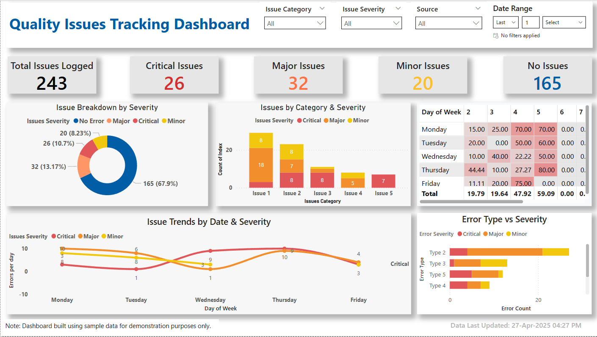

# quality-issues-tracking-dashboard

📊 **Tool Used**: Power BI  
🗂️ **Category**: Real-World Internal Project  
📁 **Dataset**: Mock data used for demonstration (dashboard visuals only; source files not shared due to confidentiality)

---

## 📌 Overview

This interactive Power BI dashboard was created to monitor and track quality issues in an internal team environment. The main objective was to identify patterns in critical, major, and minor errors using visual insights, aiding proactive decision-making and resource allocation.

---

## 🔧 Tools & Features

- **Power BI Desktop**
- **Power BI Service**
- **Power Query** for data transformation
- **DAX** for custom KPIs and measures

### Dashboard Features:
- Real-time data refresh capability (simulated with mock data)
- KPIs: Total Issues, Critical, Major, Minor, and No Issues
- Interactive filters:
  - Issue Category
  - Severity Level
  - Error Source
  - Date Range
- Visuals:
  - Donut Chart
  - Heatmap Matrix
  - Line Chart for weekly trends
  - Bar Charts for categorical insights
- Custom Date Table for better time-based analysis
- Color-coded severity levels for easy interpretation

---

## 🧠 Key Insights

- Quickly identify sources and categories with high critical issue volume
- Track weekly trend of issues to monitor progress or regress
- Breakdown of issues by severity enables better prioritization
- Helps management allocate resources to problematic areas

---

## 📷 Dashboard Preview

_Additional dashboard screenshots are available in the `/images` folder._

---

## 🎥 Dashboard Walkthrough Video

Download and watch the demo video: [Quality-Dashboard-Demo.mp4](videos/Quality-Dashboard-Demo.mp4)

---

## 🗃️ Folder Contents

| File/Folder | Description |
|-------------|-------------|
| `images/` | Contains visual snapshots of the dashboard for demo purposes |
| `README.md` | Project documentation (this file) |

> ⚠️ Note: Due to data sensitivity, this repository does not include the `.pbix` and dataset files. Screenshots are used to illustrate the dashboard's functionality without exposing confidential information.

---

## 🔗 Author

**Bharat Kumar**  
[LinkedIn](https://www.linkedin.com/in/bharat-kumar-bh) | [GitHub](https://github.com/bharat1271)
